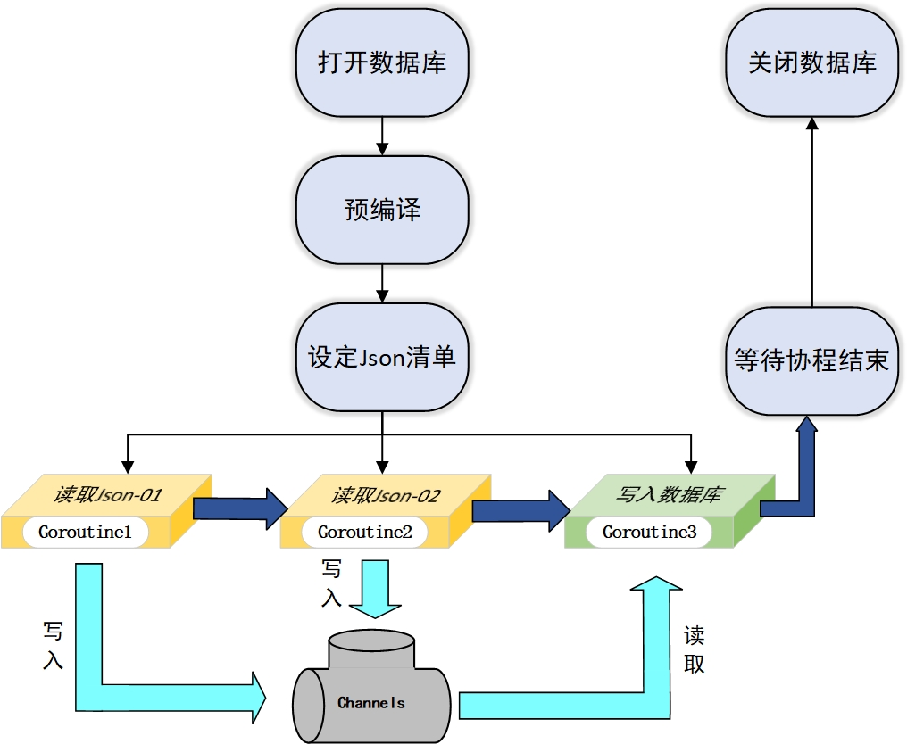

# 数据库

本次作业根据Json文件中的格式将数据库(data.db)划分为三张表：

**word**(id, word)

`id`：主键，自增

`word`：单词名称，唯一且不为空

**translations**(id, word_id, translation, type)

`id`：主键，自增

`word_id`：外键，指向 words 表的 id

`translation`：单词翻译内容，不为空

`type`：单词翻译的词性，不为空

**phrases**(id, word_id, phrase, translation)

`id`：主键，自增

`word_id`：外键，指向 words 表的 id

`phrase`：单词的相关短语内容，不为空

`translation`：单词的相关短语翻译，不为空


**其中关于表构建的SQL语句为：**

```sql
'''
CREATE TABLE IF NOT EXISTS words (
    id INTEGER PRIMARY KEY,
    word TEXT UNIQUE NOT NULL
)
'''
'''
CREATE TABLE IF NOT EXISTS translations (
    id INTEGER PRIMARY KEY,
    word_id INTEGER NOT NULL,
    translation TEXT NOT NULL,
    type TEXT NOT NULL,
    FOREIGN KEY (word_id) REFERENCES words (id),
    UNIQUE(word_id, translation, type) ON CONFLICT IGNORE
)
'''
'''
CREATE TABLE IF NOT EXISTS phrases (
    id INTEGER PRIMARY KEY,
    word_id INTEGER NOT NULL,
    phrase TEXT NOT NULL,
    translation TEXT NOT NULL,
    FOREIGN KEY (word_id) REFERENCES words (id),
    UNIQUE(word_id, phrase, translation) ON CONFLICT IGNORE
)
'''
```

# 代码实现流程

以下是完整的 Go 代码实现，分为几个主要步骤。

**1.**进行数据库连接。

`db, err := openDatabase("./data.db")`

**2.**定义结构体

本文选择将Json文件反序列为对应的嵌套结构体。

**第一个结构体为：**

```go
type WordData struct {
	Word         string        `json:"word"`
	Translations []Translation `json:"translations"`
	Phrases      []Phrase      `json:"phrases"`
}
```

**第二个结构体为：**

```go
type Translation struct {
	Translation string `json:"translation"`
	Type        string `json:"type"`
}
```

**第三个结构体为：**

```go
type Phrase struct {
	Phrase      string `json:"phrase"`
	Translation string `json:"translation"`
}
```

**3.**调用`processJson(db, filepath)`对Json文件进行反序列化并存入`[]WordData`格式的结构体切片`wordList`中。(原准备使用`Goroutine`进行并发操作，但经过实际运行发现花费的时间会更多，可能原因是SQLite是单线程的，使用并发编程也只是将操作进行串行而不是并行，反而会因为`Goroutine`争抢数据库操作增加了等待时间)

```go
var wordList []WordData
if err := json.Unmarshal(data, &wordList); err != nil {
	return fmt.Errorf("无法将Json文件%s反序列化：%w", filePath, err)
}
```

**4.**使用事务进行批量操作以节省时间，采取的batchsize=1000。

```go
batchSize := 1000
tx, err := db.Begin()
```

**5.**调用`getWord(tx, wordData.Word)`传入事务对象与数据库单词内容，判断是否存在单词并返回单词ID。

  - 存在：返回单词ID
  - 不存在：插入该单词并返回ID

**6.**调用`insertTranslations(tx, wordID, wordData.Translations)`传入事务对象，word_id和Translations切片进行数据库插入操作，调用`insertPhrases(tx, wordID, wordData.Phrases)`传入事务对象，word_id和Phrases切片进行数据库插入操作。其中使用了Prepare对SQL语句进行了预编译。

```go
stmt, _ := tx.Prepare("INSERT OR IGNORE INTO translations (word_id, translation, type) VALUES (?, ?, ?)")
stmt, _ := tx.Prepare("INSERT OR IGNORE INTO phrases (word_id, phrase, translation) VALUES (?, ?, ?)")
```

**7.**for循环是否结束。
  - 结束：打印处理当前文件花费时间同时打印总花费时间
  - 没结束：打印处理当前文件花费时间同时返回步骤3

# 处理思路

**数据冗余**

处理数据冗余以及去重的思路是根据word_id进行判断。如果word_id不存在，那么Translations和Phrases则不需要判断直接进行插入操作。如果word_id存在，那么根据数据库表内约束进行判断，(word_id, phrase, translation)与(word_id, translation, type)的组合值是否相同，如果相同就跳过，不相同则插入。这么做的原因是因为翻译和短语在不同的情况下对应着不同的word_id，一个翻译可能对应多个word，短语的组成也可能由多个word构成，所以也可能对应多个word。这就表示不能简单的根据内容来去重，而是根据组合值来判断是否为冗余数据。


**消耗时间较长**

一开始使用逐条插入的方法，处理一个文件的时间一般在2m20s左右(4-CET6-顺序.json)。因为代码语言执行速度很快，所以意识到大部分的时间都用于进行数据库操作，发现可以使用事务进行批量操作以及使用Prepare进行SQL语句预编译，之后一个文件的处理时间降到了0.2s~0.5s左右(根据文件大小浮动)。

# 数据

采取两个Json文件进行测试(3-CET4-顺序.json和4-CET6-顺序.json)。其运行结果为：

```bash
PS D:\jinshan\wanyongzhi\week03\homework\fileprocessing> go build
PS D:\jinshan\wanyongzhi\week03\homework\fileprocessing> go run .
处理第1个Json文件花费时间: 0.3498206秒
处理第2个Json文件花费时间: 0.2287369秒
处理所有文件共花费时间：0.5785575秒
```

其中得到的具体数据数量为：

```
word：6664个
translation 和 type：14251个
phrase 和 translation：48693个
```

# 更新

将`openDatabase()`更改为`initDatabase()`。更改原因是因为不确定测试的时候要不要将数据库彻底清空，然后等执行代码的时候重新构建表，还是跟原来一样只是清空表内数据但不删除表。

`initDatabase()`对比原来的`openDatabase()`增加了`createTable()`用于判断words表、translations表和phrases表是否存在，若存在则不执行操作，若不存在则按照SQL语句创建表。

在原来处理数据冗余问题上产生了分歧。不确定是保证(word_id, phrase, translation)和(word_id, translation, type)的组合值唯一，还是保证 (phrase, translation)和(translation, type)的组合值唯一。两种情况对于数据冗余的处理情况不一样。

**1.**保证3个组合值唯一的情况是允许存在一样的(phrase, translation)和(translation, type)，但前提是其对应的word_id不一样，这种情况说明有多个相同翻译和短语对应着不同的word。

**2.**保证2个组合值唯一的情况是不允许存在一样的(phrase, translation)和(translation, type)，不管对应的word_id是不是一样的，统一按照冗余数据进行处理。

我在代码中是按照第一种情况处理数据冗余的。但如果按照第二种情况进行处理，那么得到的具体数据数量为：

```
word：6664个
translation 和 type：13989个
phrase 和 translation：40735个
```

# 更新

在第四周课上听到老师说用协程处理后将代码进行了更新。

新增了使用协程对文件读取，然后将写入数据库的操作也用协程进行。这样相比于前面没使用协程的流程(先读再写)到现在变为了边读边写，并且将SQL语句预编译设为了全局变量，一共优化了大约0.1s左右。

现在的流程变更为：

1. 进行数据库连接。

2. 定义结构体。

3. 预编译SQL插入语句。

   ```go
   var (
   	insertWordStmt         *sql.Stmt
   	insertTranslationsStmt *sql.Stmt
   	insertPhrasesStmt      *sql.Stmt
   )
   
   insertWordStmt, err = db.Prepare("INSERT OR IGNORE INTO words (word) VALUES (?)")
   insertTranslationsStmt, err = db.Prepare("INSERT OR IGNORE INTO translations (word_id, translation, type) VALUES (?, ?, ?)")
   insertPhrasesStmt, err = db.Prepare("INSERT OR IGNORE INTO phrases (word_id, phrase, translation) VALUES (?, ?, ?)")
   ```

4. 定义wordLists管道进行协程之间的数据交互。

   ```go
   wordLists := make(chan []WordData, len(jsonFiles))
   ```

5. 定义done管道判断后续写入操作是否结束。

   ````go
   done := make(chan struct{})
   ````

6. 并行读取Json文件，同时并行进行写入数据库操作。

   在这块儿内容中，将原`processJson(db, filepath)`拆分为了`readFile(filePath, &wg, wordLists)`和`writeDatabase(db, wordLists, done)`，原本将读文件和写文件操作合并在一起串行运行，现在使用协程并行运行。

7. 等待Json文件读取完成后关闭管道wordList，等待数据库写入完成关闭管道done。

**流程图为：**



现在运行速度在0.45~0.47s不等,运行结果为：

```bash
PS D:\jinshan\wanyongzhi\week03\homework\fileprocessing> go build 
PS D:\jinshan\wanyongzhi\week03\homework\fileprocessing> go run .
处理所有文件共花费时间：0.4653274秒
```

# 更新

发现使用sqlite3驱动："github.com/mattn/go-sqlite3" 有C库依赖，在缺少gcc编译器的情况下无法运行，于是使用了纯Go语言搭建的驱动："modernc.org/sqlite"。但是性能下降了很多，运行时间从0.46秒提升到了0.75秒。

```bash
PS D:\jinshan\wanyongzhi\week03\homework\fileprocessing> go build
PS D:\jinshan\wanyongzhi\week03\homework\fileprocessing> go run main.go
处理所有文件共花费时间：0.7541599秒
```

