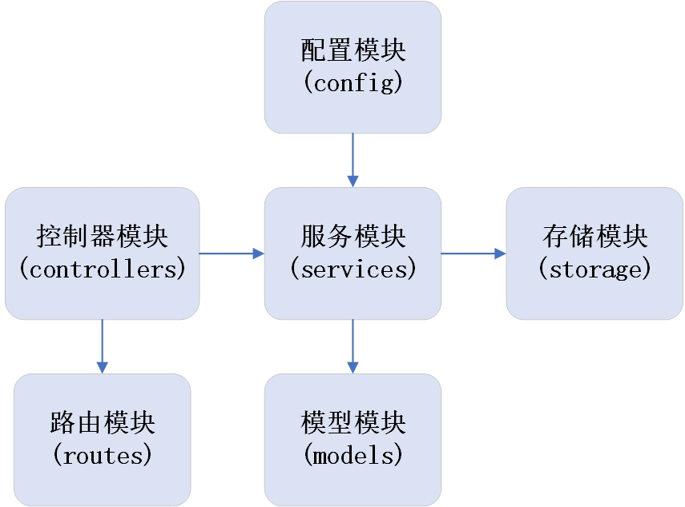
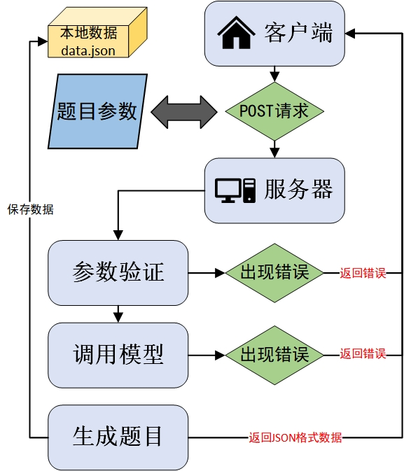

# 编程题目生成器

基于大语言模型的编程题目自动生成系统，支持多种编程语言和题目类型。

## 目录

- [参数要求](#参数要求)
- [模块架构](#模块架构)
- [运行流程](#运行流程)
- [错误应对](#错误应对)
- [数据存储](#数据存储)
- [配置与部署](#配置与部署)
- [API接口](#api接口)

## 参数要求

参数要求：
- model(非必选，默认值为tongyi):tongyi、deepseek
- language(非必选，默认值为go):go、java、python、c++、javascript
- type(非必选，默认值为1):单选题（1）、多选题（2）
- keyword(必选):并发，Gin框架，微服务等

示例请求：
```json
// 最简化请求，只提供必填参数
{
  "keyword": "goroutine"
}

// 完整请求，提供所有参数
{
  "keyword": "goroutine",
  "model": "tongyi",
  "language": "go",
  "type": 1
}

// 错误请求示例 - 拼写错误
{
  "keyword": "goroutine",
  "model": "depseek"  // 错误，应为"deepseek"
}

// 错误请求示例 - 未知参数
{
  "keyword": "goroutine",
  "modeel": "tongyi"  // 错误，未知参数"modeel"
}
```

## 模块架构

系统由以下主要模块组成：



## 各模块功能说明

1. **配置模块 (config)**
   - 负责从环境变量或.env文件加载系统配置
   - 包括API密钥、服务URL、服务器端口等配置项

2. **模型模块 (models)**
   - 定义系统使用的数据结构和模型
   - 包括请求模型、响应模型、题目类型、编程语言等
   - 提供参数验证功能

3. **服务模块 (services)**
   - AI客户端服务：负责与大模型API通信
   - 存储服务：负责题目数据的存储

4. **控制器模块 (controllers)**
   - 处理HTTP请求和响应
   - 调用服务模块生成题目并返回结果

5. **路由模块 (routes)**
   - 定义API路由规则
   - 将请求映射到对应的控制器处理函数

6. **存储模块 (routes)**
   - 将问题与数据保存到JSON文件当中


## 运行流程

系统的主要运行流程如下：



详细流程说明：

1. **客户端发起请求**
   
   - 客户端向服务器发送POST请求，包含题目生成的参数
   - 必填参数：keyword（关键词）
   - 可选参数：model（模型）、language（编程语言）、type（题目类型）
   
   ```bash
   curl -X POST http://localhost:8081/api/questions/create \
     -H "Content-Type: application/json" \
     -d '{"keyword": "goroutine", "model": "tongyi", "language": "go", "type": 1}'
   ```
   
2. **参数验证与处理**
   - 检查参数格式和有效性
   - 对于非必填参数，使用默认值：
     - model默认为"tongyi"
     - language默认为"go"
     - type默认为1（单选题）
   - 验证参数拼写是否正确，不接受错误的拼写（如"depseek"而非"deepseek"）
   - 检查是否有未定义的参数，如出现"modeel"等错误参数则返回错误

   ```go
   // 先检查未知字段
   validFields := map[string]bool{
       "model":    true,
       "language": true,
       "type":     true,
       "keyword":  true,
   }
   
   for field := range rawRequest {
       if !validFields[field] {
           return fmt.Errorf("不支持的参数: '%s'", field)
       }
   }
   
   // 然后验证各个参数
   if req.Keyword == "" {
       return fmt.Errorf("关键词(keyword)为必填项，不能为空")
   }
   ```
   
3. **调用模型**
   
   - 根据指定的model参数选择合适的AI服务（tongyi或deepseek）
   - 构建提示语（prompt）并发送请求到对应的API
   - 接收并解析API返回的JSON数据
   
   ```go
   func buildPrompt(req *models.QuestionRequest) string {
       questionType := "单选题"
       if req.GetQuestionType() == models.MultiChoice {
           questionType = "多选题"
       }
       
       language := string(req.GetLanguage())
       keyword := req.Keyword
       
       var sb strings.Builder
       sb.WriteString(fmt.Sprintf("生成一道关于%s编程语言的%s", language, questionType))
       sb.WriteString(fmt.Sprintf("，主题关键词为：%s", keyword))
       // ...
       
       return sb.String()
   }
   ```

4. **生成题目**
   - 从API响应中提取题目内容、选项和正确答案
   - 验证题目格式是否正确（如选项数量是否为4个）

5. **存储数据**
   - 将生成的题目数据存储到JSON文件中
   - 按日期组织存储，便于后续查询

   ```go
   func (s *StorageService) SaveQuestion(data *models.QuestionData) error {
       // 获取当前日期作为文件名
       today := time.Now().Format("2006_01_02")
       filename := filepath.Join(s.DataDir, fmt.Sprintf("%s.json", today))
       
       // 读取现有数据并追加新数据
       // ...
       
       return nil
   }
   ```
   
6. **返回结果**
   - 将生成的题目返回给客户端
   - 包括题目内容、选项和正确答案

## 错误应对

系统实现了完善的错误处理机制，包括：

### 1. 请求参数错误

- **参数缺失**：keyword为必填项，如果缺失则返回错误

  ```json
  {
    "code": -1,
    "msg": "关键词(keyword)为必填项，不能为空"
  }
  ```
  
- **参数拼写错误**：如"depseek"而非"deepseek"，返回明确的错误提示

  ```json
  {
    "code": -1,
    "msg": "无效的模型: 'depseek'，只支持'deepseek' 或 'tongyi'"
  }
  ```
  
- **不支持的参数**：如出现"modeel"等未定义的参数，返回错误提示

  ```json
  {
    "code": -1,
    "msg": "不支持的参数: 'modeel'"
  }
  ```
  
- **类型错误**：如type值不是1或2，返回错误提示

  ```json
  {
    "code": -1,
    "msg": "无效的题目类型: 3，只支持 1(单选题) 或 2(多选题)"
  }
  ```

### 2. API调用错误

- **API密钥未配置**：如对应模型的API密钥未配置，返回明确提示

  ```json
  {
    "code": -2,
    "msg": "生成题目失败: Qwen API密钥未配置"
  }
  ```
  
- **网络错误**：如连接超时或服务不可用，返回相应错误信息

  ```json
  {
    "code": -2,
    "msg": "生成题目失败: 发送请求失败: context deadline exceeded"
  }
  ```
  
- **响应解析错误**：如API返回的数据格式不符合预期，系统会尝试修复或返回错误

### 3. 数据存储错误

- 即使数据存储失败，系统仍会将生成的题目返回给用户
- 存储错误会被记录在日志中，但不会影响用户体验

  ```json
  {
    "code": -3,
    "msg": "保存题目数据失败: 写入文件失败: permission denied",
    "aiRes": {
      "title": "关于Go语言中goroutine的描述...",
      "answer": ["选项A", "选项B", "选项C", "选项D"],
      "right": [2]
    }
  }
  ```

### 4. 错误码说明

系统使用以下错误码：
- `0`: 成功
- `-1`: 请求参数错误（格式错误、缺少必填参数、参数拼写错误等）
- `-2`: 生成题目失败（API调用失败、模型不可用等）
- `-3`: 保存题目数据失败（文件系统错误等）

```go
switch errorType {
case ParamError:
    return &models.HTTPResponse{Code: -1, Msg: err.Error()}
case APIError:
    return &models.HTTPResponse{Code: -2, Msg: "生成题目失败: " + err.Error()}
case StorageError:
    return &models.HTTPResponse{Code: -3, Msg: "保存题目数据失败: " + err.Error(), AIRes: response}
}
```

## 数据存储

系统使用基于文件的JSON存储方式来持久化生成的题目数据。

- 数据按日期分文件存储，文件名格式为`YYYY_MM_DD.json`
- 每个文件包含当天生成的所有题目数据的数组

```json
{
    "aiStartTime": "2025-04-21T16:35:35.2800816+08:00",
    "aiEndTime": "2025-04-21T16:35:39.4946339+08:00",
    "aiCostTime": 4,
    "aiReq": {
      "model": "qwen",
      "type": 2,
      "keyword": "基础语法"
    },
    "aiRes": {
      "title": "在Go语言中，以下哪些是有效的基础语法特性？",
      "answer": [
        "A. 变量必须先声明后使用",
        "B. 支持指针运算如加减",
        "C. 使用 := 操作符可以同时声明并初始化变量",
        "D. 函数可以有多个返回值"
      ],
      "right": [
        0,
        2,
        3
      ]
    }
  }
```

### 存储内容

每个题目数据包含以下信息：
- `aiStartTime`: AI请求开始时间
- `aiEndTime`: AI请求结束时间
- `aiCostTime`: AI请求耗时
- `aiReq`: 用户请求参数（包括model、language、type、keyword）
- `aiRes`: AI返回结果（包括题目标题、选项和正确答案）

### 存储目录

默认情况下，数据存储在项目根目录的`data`文件夹中：
```
项目根目录/
├── data/
│   ├── 2025_04_21.json
│   ├── 2025_04_22.json
│   └── ...
```

## 配置与部署

### 环境变量

系统通过环境变量或`.env`文件进行配置，主要配置项包括：

```
# API配置
QWEN_API_KEY=sk-********    
QWEN_API_URL=https://dashscope.aliyuncs.com/api/v1/services/aigc/text-generation/generation
DEEPSEEK_API_KEY=sk-********
DEEPSEEK_API_URL=https://api.deepseek.com/v1/chat/completions

# 服务器配置
PORT=8081
HOST=localhost
```

## API接口

### 创建题目

- **URL**: `http://localhost:8081/api/questions/create`
- **方法**: `POST`
- **请求体**:
  ```json
  {
    "keyword": "goroutine",    // 必填，题目关键词
    "model": "tongyi",         // 可选，默认为"tongyi"，可选值："tongyi"、"deepseek"
    "language": "go",          // 可选，默认为"go"，可选值："go"、"java"、"python"、"c++"、"javascript"
    "type": 1                  // 可选，默认为1，可选值：1（单选题）、2（多选题）
  }
  ```
- **成功响应** (200):
  
  ```json
  {
      "code": 0,
      "msg": "",
      "aiRes": {
          "title": "在Java中，下列哪个关键字用于定义一个类？",
          "answer": [
              "function",
              "class",
              "def",
              "define"
          ],
          "right": [
              1
          ]
      }
  }
  ```
- **错误响应** (200/400):
  ```json
  {
      "code": -1,
      "msg": "关键词(keyword)为必填项，不能为空",
      "aiRes": {
          "title": "",
          "answer": null,
          "right": null
      }
  }
  ```

### 请求示例

使用curl:
```bash
curl -X POST http://localhost:8081/api/questions/create \
  -H "Content-Type: application/json" \
  -d '{
    "keyword": "goroutine",
    "model": "tongyi",
    "language": "go",
    "type": 1
  }'
```

使用postman:

```bash
POST http://localhost:8081/api/questions/create 
```

在body的raw中输入请求体:

```json
{
    "model":"tongyi",
    "language":"java",
    "keyword":"基础语法"
}
```

