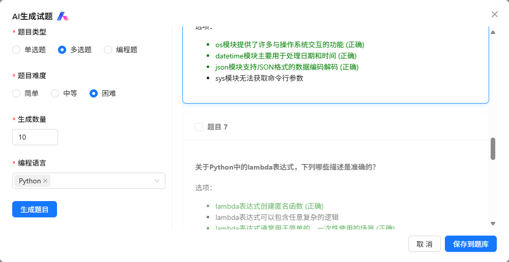

# 题库管理系统

这是一个包含前端和后端的完整的题库管理项目。根据第四次作业要求，该项目支持题库的增删改查、AI出题和手工出题等功能。

## 系统架构

- 前端：React + TypeScript + Vite + Ant Design
- 后端：Go + Gin框架 + SQLite

## 功能特性

**题库管理**：查询、添加、编辑和删除题目

**出题功能**：支持AI自动出题和手工添加题目

**AI出题预览**：预览AI生成的题目，选择合适的添加到题库

**模糊搜索**：根据输入的文字与选择题型在题库中进行搜索

## 技术栈总结

### 前端

- **核心框架**: React
- **语言**: TypeScript
- **构建工具**: Vite
- **UI组件库**: Ant Design
- **HTTP客户端**: Axios
- **路由**: React Router

### 后端

- **语言**: Go
- **Web框架**: Gin
- **数据库**: SQLite

## 后端接口

本项目设计为增删改查以及AI出题五个接口：

1. **`GET /api/questions`**：查询接口，获取所有题目列表。
2. **`POST /api/questions`**：加题接口，添加一道新的题目到题库中。
3. **`PUT /api/questions/:id`**：编辑接口，更新指定ID的题目信息。
4. **`DELETE /api/questions/:id`**：删除接口，删除指定ID的题目。
5. **`POST /api/ai/generate-question`**:出题接口，根据参数调用大模型API进行出题。

总的来说，后端主要围绕题目的增删改查以及AI出题功能，搭建了 **5个主要的API接口**，并由`question_controller.go`中的 **5个对应的处理方法** 来实现这些接口的业务逻辑。这些方法会调用`services/storage.go`中的函数与SQLite数据库进行交互。

## 前端结构

本项目前端使用React构建用户界面，并通过下面几种方式与后端进行交互和展示数据：

1. **组件化结构**：
   - **页面组件 ([pages](vscode-file://vscode-app/d:/VScode/Microsoft VS Code/resources/app/out/vs/code/electron-sandbox/workbench/workbench.html))**: 如 `QuestionList.tsx` (题库管理)、`AddQuestion.tsx` (手工出题)、`AIQuestionPage.tsx` (AI出题)、`AIPreview.tsx` (AI出题预览) 和 `StudyNotes.tsx` (学习心得)。这些组件负责各自页面的布局和逻辑。
   - **通用组件 ([components](vscode-file://vscode-app/d:/VScode/Microsoft VS Code/resources/app/out/vs/code/electron-sandbox/workbench/workbench.html))**:  使用`SimpleMarkdown.tsx` 用于渲染Markdown内容。

2. **路由管理**：
   - `App.tsx` 文件中使用了React Router (`react-router-dom`) 来定义不同URL路径对应的页面组件，实现了单页应用的导航。
3. **API服务调用**:
   - `client/src/services/api.ts` 文件封装了与后端API交互的函数。它使用`axios`库发送HTTP请求到后端接口，并处理响应。

4. **状态管理**：
   - 各个页面组件使用React的[useState](vscode-file://vscode-app/d:/VScode/Microsoft VS Code/resources/app/out/vs/code/electron-sandbox/workbench/workbench.html)和[useEffect](vscode-file://vscode-app/d:/VScode/Microsoft VS Code/resources/app/out/vs/code/electron-sandbox/workbench/workbench.html) Hooks来管理组件内部的状态（如题目列表、加载状态、错误信息等）和处理副作用（如在组件加载时获取数据）。
5. **UI库**:
   - 使用Ant Design作为UI组件库，丰富了界面的UI设计。

## 项目工作流程

1. **页面访问**: 用户通过浏览器访问项目。
2. **前端加载**: 后端Go服务器（通过`server/main.go`中的静态文件服务）提供前端编译后的静态资源（HTML, CSS, JavaScript，位于`server/static`目录）。
3. **前端渲染**: 浏览器加载并执行前端代码，React应用初始化，根据当前URL渲染相应的页面组件。
4. **用户交互**: 用户在前端界面进行交互操作（如点击按钮）。
5. **API请求**: 前端组件收到交互操作通过`api.ts`向后端Gin服务器发送HTTP API请求。
6. **后端处理**:
   - Gin框架接收请求，根据路由规则（定义在`server/routes/routes.go`中）将请求分发给相应的控制器方法（定义在`server/controllers/question_controller.go`中）。
   - 控制器方法处理业务逻辑：
     - 对于数据库操作，调用`server/services/storage.go`中的函数与SQLite数据库（`server/data/questions.db`）进行数据交互。
     - 对于AI出题，调用`server/services/ai_client.go`与大模型进行通信。
7. **API响应**: 后端控制器方法将处理结果作为HTTP响应返回给前端。
8. **前端更新**: 前端接收到API响应后，更新组件状态，React根据新的状态重新渲染UI，向用户展示最新的数据或操作结果。

## 项目预览

**1.**学习心得界面：


**2.**题库管理界面：


**3.**AI出题界面：



**4.**人工出题界面：


**5.**数据库格式：


## 学习心得

### Go语言学习

在本项目中，我通过实践掌握了Go语言的多个核心特性及其在后端开发中的应用：

1. Go语言特性：体验了Go语言的简洁语法、强类型系统，逐渐体会到Go语言相较于其他语言的优势。

2. Gin框架：学习并应用了Gin这个Go语言搭建的Web框架。具体来说，通过该项目掌握了其清晰的路由定义方式，使我对API的开发有了更深刻的理解。

3. SQLite数据库：接触了轻量级数据库SQLite，并学习了如何在Go语言中进行数据库操作，如数据的增删改查以及重要的事务管理，确保数据操作的原子性和一致性。

### 前后端分离架构

通过本项目实践了前后端分离的架构模式，并实现了统一打包部署：

1. API设计：核心在于设计了一套清晰的RESTful API作为前后端通信的桥梁。在后端通过Gin框架实现了API接口，然后在前端通过HTTP请求进行调用，让我更深刻的了解了前后端之间的交互。

2. 静态资源：学习了如何在Go后端应用中集成并提供前端编译后的静态资源。在后端服务器中配置了静态文件服务，指向前端构建产物所在的目录，并处理前端路由，使得整个应用可以从同一个端口访问。

3. 错误处理：在后端实现了统一的错误处理机制，这有助于向前端提供一致的错误信息格式，提升了系统的稳定性和用户体验。

### 打包的用处与重要性

通过该项目意识到了前端打包过程的用处和重要性：

1. 优化与部署：前端代码通过Vite等工具执行进行打包。将源代码转换、压缩、合并成优化过的静态文件。这些优化后的文件体积更小，加载更快。

2. 集成部署：打包后的静态资源可以直接被后端服务器托管。如server/main.go中配置了静态文件服务，将前端构建的产物作为网站的入口和资源提供给浏览器，实现了前后端项目的统一部署，简化了部署流程。


## 开发环境

### 前端开发

```bash
cd client
npm install
npm run dev
```

前端开发服务器将在 [http://localhost:3000](http://localhost:3000) 运行

### 后端开发

```bash
cd server
go run main.go
```

后端API服务将在 [http://localhost:8080](http://localhost:8080) 运行

